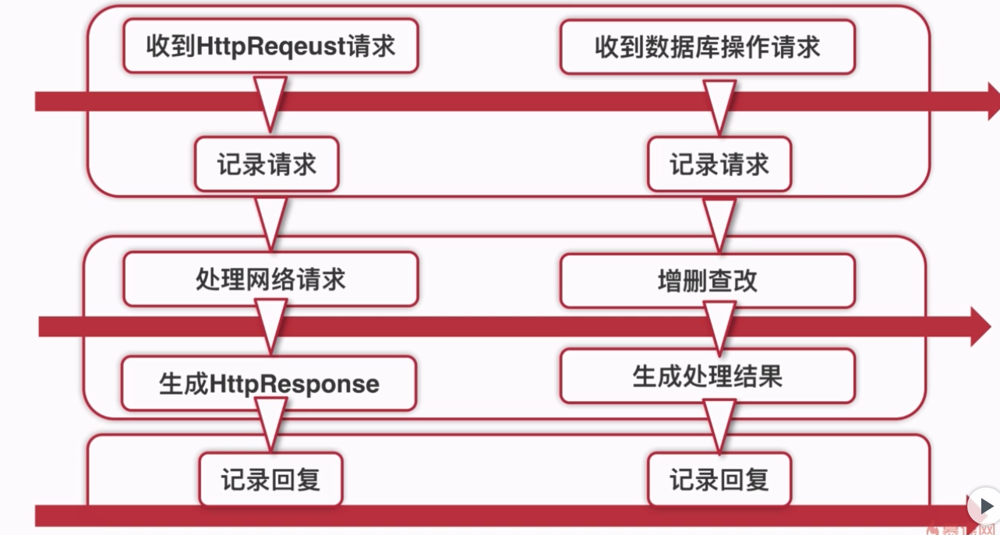
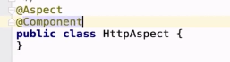
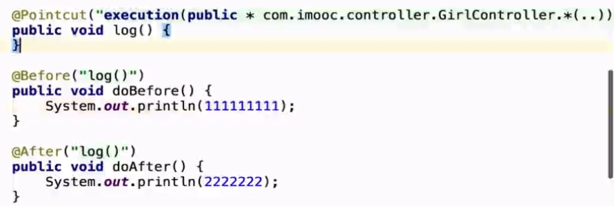

#                springboot WEB整合笔记 #

## 1 AOP处理请求 ##

### 1-1 AOP是一种编程范式 ###

与语言无关，是一种程序设计思想

面向切面（AOP）

面向对象（OOP）

面向过程（POP）

面向过程到面向对象的区别：

面向过程：强调的是过程和流程规划

面向对象：建对象。。。


相当于换个角度看世界，换个姿势处理问题： 

AOP：1 利用的是横切，将面向对象垂直和水平来划分

​            2 将通用逻辑从业务逻辑中分离出来



AOP开发步骤：

1 导入spring-boot-starter-aop

2 先建一个aspect包

3 新建一个class类型的类 ，例如先建一个httpAspect的class类

4 在类上面添加@Aspect注解，引入spring容器需要加@Component类



5 在类里面添加注解@before

```java
@Before("execution(public * com.imooc.controller.方法（。。是任何方法都会被拦截）"）)
public void log(){
    syso()//输入表示
}

```

6 逻辑后面类似只需要加@after注解其他类似

这里简化代码的做法



说明：@Pointcut 公用代码块 和写明了公用方法

### 2-1 统一异常处理 ###


​           

