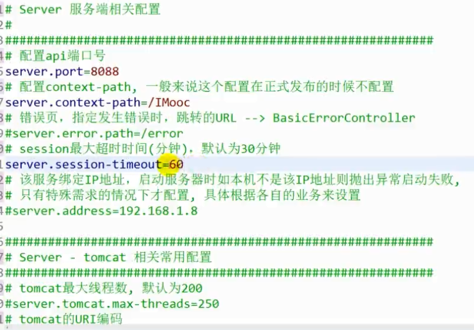

# springboot开发常用技术整合笔记 #

## 1 springboot资源属性配置 ##

### 1-1 资源文件中的属性配置与映射到实体类 ###

此项目代码托管地址：

https://github.com/leechenxiang/imooc-springboot-starter 

```xml
需要加入
spring-boot-configuration-processor  标签
```

### 1-2 springboot资源文件配置server以及tomcat ###

server 服务有关配置




## 2 springboot整合模板引擎 ##

2-1整合freemaker  和thymeleaf

### Fremarker

1 fremark是一款模板引擎

2 fremarker不是web框架

整合步骤：

1 导入fremaker

```properties
<!-- 引入 freemarker 模板依赖 -->
		<dependency>
			<groupId>org.springframework.boot</groupId>
			<artifactId>spring-boot-starter-freemarker</artifactId>
</dependency>
```

2 在static里面进行编写代码，fremarker的模板一般放在static资源下，在下面建议ftl文件名结尾的文件

当然首先得配置fremarker

```properties
#
# freemarker 静态资源配置
#
############################################################
#设定ftl文件路径
spring.freemarker.template-loader-path=classpath:/templates
# 关闭缓存, 即时刷新, 上线生产环境需要改为true
spring.freemarker.cache=false
spring.freemarker.charset=UTF-8
spring.freemarker.check-template-location=true
spring.freemarker.content-type=text/html
spring.freemarker.expose-request-attributes=true
spring.freemarker.expose-session-attributes=true
spring.freemarker.request-context-attribute=request
spring.freemarker.suffix=.ftl
```

新建的ftl

```html
<!DOCTYPE html>
<html>
<head lang="en">
    <meta charset="UTF-8" />
    <title></title>
</head>
<body>
FreeMarker模板引擎
<h1>center page</h1>
</body>
</html>
```

controller层调用

```java

@Controller
@RequestMapping("ftl")
public class FreemarkerController {

	@Autowired
	private Resource resource;
	
	@RequestMapping("/index")
    public String index(ModelMap map) {
        map.addAttribute("resource", resource);
        return "freemarker/index";
    }
	
	@RequestMapping("center")
    public String center() {
        return "freemarker/center/center";
    }

}
```

### thymeleaf模板

常用标签：

基本使用方式            

对象引用              

时间类型

text与utext 

条件判断 th:if 

URL 引入静态资源文件js/css

th:unless 与 th:if 

循环 th:each

text 与utext

th:swith yu th:case

```xml
<div th:object="${user}">
	用户姓名：<input th:id="*{name}" th:name="*{name}" th:value="*{name}"/>
	<br/>
	用户年龄：<input th:value="*{age}"/>
	<br/>
	用户生日：<input th:value="*{#dates.format(birthday, 'yyyy-MM-dd hh:mm:ss')}"/>
	<br/>
</div>
```

text 与 utext

```xml
text 与 utext ：<br/>
<span th:text="${user.desc}">abc</span>
<br/>
<span th:utext="${user.desc}">abc</span>
<br/>
<br/>
```

```java
	@RequestMapping("test")
    public String test(ModelMap map) {
		
		User u = new User();
		u.setName("superadmin");
		u.setAge(10);
		u.setPassword("123465");
		u.setBirthday(new Date());
		u.setDesc("<font color='green'><b>hello imooc</b></font>");
```

URL

```java
URL:<br/>
<a href="" th:href="@{http://www.imooc.com}">网站地址</a>
<br/>
```

引用静态资源

```properties
#设定静态文件路径，js,css等
spring.mvc.static-path-pattern=/static/**
```

```xml
<script th:src="@{/static/js/test.js}"></script>
```

Form

```xml
<form th:action="@{/th/postform}" th:object="${user}" method="post" th:method="post">
    <input type="text" th:field="*{name}"/>
    <input type="text" th:field="*{age}"/>
    <input type="submit"/>
</form>
```

判断if

```xml
<div th:if="${user.age} == 18">十八岁的天空</div>
<div th:if="${user.age} gt 18">你老了</div>
<div th:if="${user.age} lt 18">你很年轻</div>
<div th:if="${user.age} ge 18">大于等于</div>
<div th:if="${user.age} le 18">小于等于</div>
```

选择

```xml
<select>
     <option >选择框</option>
     <option th:selected="${user.name eq 'lee'}">lee</option>
     <option th:selected="${user.name eq 'imooc'}">imooc</option>
     <option th:selected="${user.name eq 'LeeCX'}">LeeCX</option>
</select>
```

table

```xml
<table>
    <tr>
        <th>姓名</th>
        <th>年龄</th>
        <th>年龄备注</th>
        <th>生日</th>
    </tr>
    <tr th:each="person:${userList}">
        <td th:text="${person.name}"></td>
        <td th:text="${person.age}"></td>
        <td th:text="${person.age gt 18} ? 你老了 : 你很年轻">18岁</td>
        <td th:text="${#dates.format(user.birthday, 'yyyy-MM-dd hh:mm:ss')}"></td>
    </tr>
</table>
```

switch

```xml
<div th:switch="${user.name}">
  <p th:case="'lee'">lee</p>
  <p th:case="#{roles.manager}">普通管理员</p>
  <p th:case="#{roles.superadmin}">超级管理员</p>
  <p th:case="*">其他用户</p>
</div>
```

```properties
############################################################
#
# 用户自定义权限
#
############################################################
# 普通管理员
roles.manager=manager
roles.superadmin=superadmin
```

## 3 springboot异常处理

### 1 spring boot配置全局的一场捕获

页面的跳转形式

ajax形式

统一的返回异常的形式


## 4 spring boot整合mybatis

### 4-1引入依赖

```xml
<!--mybatis-->
		<dependency>
		    <groupId>org.mybatis.spring.boot</groupId>
		    <artifactId>mybatis-spring-boot-starter</artifactId>
		    <version>1.3.1</version>
		</dependency>
		<!--mapper-->
		<dependency>
		    <groupId>tk.mybatis</groupId>
		    <artifactId>mapper-spring-boot-starter</artifactId>
		    <version>1.2.4</version>
		</dependency>
		<!--pagehelper-->
		<dependency>
		    <groupId>com.github.pagehelper</groupId>
		    <artifactId>pagehelper-spring-boot-starter</artifactId>
		    <version>1.2.3</version>
		</dependency>

		<dependency>
			<groupId>com.alibaba</groupId>
			<artifactId>druid-spring-boot-starter</artifactId>
			<version>1.1.9</version>
		</dependency>

		<dependency>
			<groupId>org.mybatis.generator</groupId>
			<artifactId>mybatis-generator-core</artifactId>
			<version>1.3.2</version>
			<scope>compile</scope>
			<optional>true</optional>
		</dependency>
```

在properties文件中配置相关mybatis的属性

```properties


############################################################
#
# 配置数据源相关	使用阿里巴巴的 druid 数据源
#
############################################################
spring.datasource.url=jdbc:mysql://localhost:3306/leecx
spring.datasource.username=root
spring.datasource.password=root
spring.datasource.driver-class-name=com.mysql.jdbc.Driver
spring.datasource.druid.initial-size=1
spring.datasource.druid.min-idle=1
spring.datasource.druid.max-active=20
spring.datasource.druid.test-on-borrow=true
spring.datasource.druid.stat-view-servlet.allow=true


############################################################
#
# mybatis 配置
#
############################################################
# mybatis 配置
mybatis.type-aliases-package=com.imooc.pojo
mybatis.mapper-locations=classpath:mapper/*.xml
# 通用 Mapper 配置
mapper.mappers=com.imooc.utils.MyMapper
mapper.not-empty=false
mapper.identity=MYSQL
# 分页插件配置
pagehelper.helperDialect=mysql
pagehelper.reasonable=true
pagehelper.supportMethodsArguments=true
pagehelper.params=count=countSql

```

yml中配置的属性为：

```properties
mybatis:
    type-aliases-package: tk.mybatis.springboot.model
    mapper-locations: classpath:mapper/*.xml

mapper:
    mappers:
        - tk.mybatis.springboot.util.MyMapper
    not-empty: false
    identity: MYSQL

pagehelper:
    helperDialect: mysql
    reasonable: true
    supportMethodsArguments: true
    params: count=countSql
```

配置逆向工具的文件GeneratorDisplay类

```java

public class GeneratorDisplay {

	public void generator() throws Exception{

		List<String> warnings = new ArrayList<String>();
		boolean overwrite = true;
		//指定 逆向工程配置文件
		File configFile = new File("generatorConfig.xml"); 
		ConfigurationParser cp = new ConfigurationParser(warnings);
		Configuration config = cp.parseConfiguration(configFile);
		DefaultShellCallback callback = new DefaultShellCallback(overwrite);
		MyBatisGenerator myBatisGenerator = new MyBatisGenerator(config,
				callback, warnings);
		myBatisGenerator.generate(null);

	} 
	
	public static void main(String[] args) throws Exception {
		try {
			GeneratorDisplay generatorSqlmap = new GeneratorDisplay();
			generatorSqlmap.generator();
		} catch (Exception e) {
			e.printStackTrace();
		}
		
	}
}
```

注意需要有generatorConfig.xml文件这个是对逆向工具生成的地址和一些配置

```xml
<?xml version="1.0" encoding="UTF-8"?>
<!DOCTYPE generatorConfiguration
        PUBLIC "-//mybatis.org//DTD MyBatis Generator Configuration 1.0//EN"
        "http://mybatis.org/dtd/mybatis-generator-config_1_0.dtd">

<generatorConfiguration>
    <context id="MysqlContext" targetRuntime="MyBatis3Simple" defaultModelType="flat">
        <property name="beginningDelimiter" value="`"/>
        <property name="endingDelimiter" value="`"/>

        <plugin type="tk.mybatis.mapper.generator.MapperPlugin">
            <property name="mappers" value="com.imooc.utils.MyMapper"/>
        </plugin>

        <jdbcConnection driverClass="com.mysql.jdbc.Driver"
                        connectionURL="jdbc:mysql://localhost:3306/leecx"
                        userId="root"
                        password="root">
        </jdbcConnection>

        <!-- 对于生成的pojo所在包 -->
        <javaModelGenerator targetPackage="com.imooc.pojo" targetProject="src/main/java"/>

		<!-- 对于生成的mapper所在目录 -->
        <sqlMapGenerator targetPackage="mapper" targetProject="src/main/resources"/>

		<!-- 配置mapper对应的java映射 -->
        <javaClientGenerator targetPackage="com.imooc.mapper" targetProject="src/main/java"
                             type="XMLMAPPER"/>

         <!-- 对应数据库中表的名称 -->
		<table tableName="sys_user"></table>
		 
    </context>
</generatorConfiguration>
```

以上配置好了之后选择GeneratorDisplay运行程序之后刷新，就会产生mapper类的映射和配置文件和实体类

生成类的展示：

**SysUserMapper.xml**

```xml
<?xml version="1.0" encoding="UTF-8" ?>
<!DOCTYPE mapper PUBLIC "-//mybatis.org//DTD Mapper 3.0//EN" "http://mybatis.org/dtd/mybatis-3-mapper.dtd" >
<mapper namespace="com.imooc.mapper.SysUserMapper" >
  <resultMap id="BaseResultMap" type="com.imooc.pojo.SysUser" >
    <!--
      WARNING - @mbg.generated
    -->
    <id column="id" property="id" jdbcType="VARCHAR" />
    <result column="username" property="username" jdbcType="VARCHAR" />
    <result column="password" property="password" jdbcType="VARCHAR" />
    <result column="nickname" property="nickname" jdbcType="VARCHAR" />
    <result column="age" property="age" jdbcType="INTEGER" />
    <result column="sex" property="sex" jdbcType="INTEGER" />
    <result column="job" property="job" jdbcType="INTEGER" />
    <result column="face_image" property="faceImage" jdbcType="VARCHAR" />
    <result column="province" property="province" jdbcType="VARCHAR" />
    <result column="city" property="city" jdbcType="VARCHAR" />
    <result column="district" property="district" jdbcType="VARCHAR" />
    <result column="address" property="address" jdbcType="VARCHAR" />
    <result column="auth_salt" property="authSalt" jdbcType="VARCHAR" />
    <result column="last_login_ip" property="lastLoginIp" jdbcType="VARCHAR" />
    <result column="last_login_time" property="lastLoginTime" jdbcType="TIMESTAMP" />
    <result column="is_delete" property="isDelete" jdbcType="INTEGER" />
    <result column="regist_time" property="registTime" jdbcType="TIMESTAMP" />
  </resultMap>
</mapper>
```

**SysUserMapper.java**

```java
public interface SysUserMapper extends MyMapper<SysUser> {
}
```

pojo目录下面的SysUser


### 4-2 整合mybatis的CRUD

1 首先需要在主程序入口处配置扫描包加载应用程序

```java
//扫描 mybatis mapper 包路径
@MapperScan(basePackages = "com.imooc.mapper")
```

做一个保存操作

2 创建一个service层并创建一个UserService类

```java
public interface UserService {

	public void saveUser(SysUser user) throws Exception;

	public void updateUser(SysUser user);

	public void deleteUser(String userId);

	public SysUser queryUserById(String userId);

	public List<SysUser> queryUserList(SysUser user);

	public List<SysUser> queryUserListPaged(SysUser user, Integer page, Integer pageSize);

	public SysUser queryUserByIdCustom(String userId);
	
	public void saveUserTransactional(SysUser user);
}
```

3 重写它的实现类

```java

@Service
public class UserServiceImpl implements UserService {

	@Autowired
	private SysUserMapper userMapper;
	
	@Autowired
	private SysUserMapperCustom userMapperCustom;
	
	@Override
	@Transactional(propagation = Propagation.REQUIRED)
	public void saveUser(SysUser user) throws Exception {
		
		try {
			Thread.sleep(4000);
		} catch (InterruptedException e) {
			e.printStackTrace();
		}
		
		userMapper.insert(user);
	}

	
}

```

4  写controller类

```java
@RestController
@RequestMapping("mybatis")
public class MyBatisCRUDController {
	
	@Autowired
	private UserService userService;
	
	@Autowired
	private Sid sid;
	
	@RequestMapping("/saveUser")
	public IMoocJSONResult saveUser() throws Exception {
		
		String userId = sid.nextShort();
		
		SysUser user = new SysUser();
		user.setId(userId);
		user.setUsername("imooc" + new Date());
		user.setNickname("imooc" + new Date());
		user.setPassword("abc123");
		user.setIsDelete(0);
		user.setRegistTime(new Date());
		
		userService.saveUser(user);
		
		return IMoocJSONResult.ok("保存成功");
	}
	
```

注意使用sid是一个工具包使用它需要导入org.n3r.idworker包


然后再主程序入口类配置扫描

```java
//扫描 所有需要的包, 包含一些自用的工具类包 所在的路径
@ComponentScan(basePackages= {"com.imooc", "org.n3r.idworker"})
```

用法是先注入

```java
@Autowire

private Sid sid;
```

### 4-3 使用mybatis-pagehelper实现分页

1 在controller定义page和size

```java
@RequestMapping("/queryUserListPaged")
	public IMoocJSONResult queryUserListPaged(Integer page) {
		
		if (page == null) {
			page = 1;
		}

		int pageSize = 10;
		
		SysUser user = new SysUser();
//		user.setNickname("lee");
		
		List<SysUser> userList = userService.queryUserListPaged(user, page, pageSize);
		
		return IMoocJSONResult.ok(userList);
	}
```

2 在serviceImpl具体实现分页的方法

```java
@Transactional(propagation = Propagation.SUPPORTS)
	public List<SysUser> queryUserListPaged(SysUser user, Integer page, Integer pageSize) {
		// 开始分页
        PageHelper.startPage(page, pageSize);
		
		Example example = new Example(SysUser.class);
		Example.Criteria criteria = example.createCriteria();
		
		if (!StringUtils.isEmptyOrWhitespace(user.getNickname())) {
			criteria.andLike("nickname", "%" + user.getNickname() + "%");
		}
		example.orderBy("registTime").desc();
		List<SysUser> userList = userMapper.selectByExample(example);
		
		return userList;
	}
```

### 4-4 自定义的mapper

1 自定义一个SysUserMapperCustom类

```java
public interface SysUserMapperCustom {
	
	List<SysUser> queryUserSimplyInfoById(String id);
}
```


2 自定义一个SysUserMapperCustom.xml

```xml
<?xml version="1.0" encoding="UTF-8" ?>
<!DOCTYPE mapper PUBLIC "-//mybatis.org//DTD Mapper 3.0//EN" "http://mybatis.org/dtd/mybatis-3-mapper.dtd" >
<mapper namespace="com.imooc.mapper.SysUserMapperCustom" >
  
  <!-- 查询简单的用户信息 -->
	<select id="queryUserSimplyInfoById" resultType="com.imooc.pojo.SysUser" 
										 parameterType="java.lang.String" >
	    select 
	    	*
	    from 
	    	sys_user
	    where 
	    	id = #{id,jdbcType=VARCHAR}
	</select>
</mapper>
```

3 然后在serviceImpl层注入对象使用自定义的mapper即可

```java
@Autowired
	private SysUserMapperCustom userMapperCustom;
@Override
	@Transactional(propagation = Propagation.SUPPORTS)
	public SysUser queryUserByIdCustom(String userId) {
		
		List<SysUser> userList = userMapperCustom.queryUserSimplyInfoById(userId);
		
		if (userList != null && !userList.isEmpty()) {
			return (SysUser)userList.get(0);
		}
		
		return null;
	}
```


### 4-5 spring boot整合持久层事物


```java
@Transactional(propagation = Propagation.SUPPORTS)
```

```
@Transactional(propagation = Propagation.REQUIRED)
```


## 5 spring boot整合redis

### 5-1 redis准备和使用

1 引入相关的依赖

```xml
<!-- 引入 redis 依赖 -->
		<dependency>
			<groupId>org.springframework.boot</groupId>
			<artifactId>spring-boot-starter-data-redis</artifactId>
		</dependency>
```

2 对资源文件进行相关的配置

```properties
############################################################
#
# REDIS 配置
#
############################################################
# Redis数据库索引（默认为0）
spring.redis.database=1
# Redis服务器地址
spring.redis.host=192.168.1.191
# Redis服务器连接端口
spring.redis.port=6379
# Redis服务器连接密码（默认为空）
spring.redis.password=
# 连接池最大连接数（使用负值表示没有限制）
spring.redis.pool.max-active=1000
# 连接池最大阻塞等待时间（使用负值表示没有限制）
spring.redis.pool.max-wait=-1
# 连接池中的最大空闲连接
spring.redis.pool.max-idle=10
# 连接池中的最小空闲连接
spring.redis.pool.min-idle=2
# 连接超时时间（毫秒）
spring.redis.timeout=0
```

3 controller层使用redis

```java
@RestController
@RequestMapping("redis")
public class RedisController {
	
	@Autowired
	private StringRedisTemplate strRedis;
	
	@Autowired
	private RedisOperator redis;
	
	@RequestMapping("/test")
	public IMoocJSONResult test() {
		
		strRedis.opsForValue().set("imooc-cache", "hello 慕课网~~~~~~");
		
		SysUser user = new SysUser();
		user.setId("100111");
		user.setUsername("imooc");
		user.setPassword("abc123");
		user.setIsDelete(0);
		user.setRegistTime(new Date());
		strRedis.opsForValue().set("json:user", JsonUtils.objectToJson(user));
		
		SysUser jsonUser = JsonUtils.jsonToPojo(strRedis.opsForValue().get("json:user"), SysUser.class);
		
		return IMoocJSONResult.ok(jsonUser);
	}
	
```

### 5-2 	spring boot使用已封装好的redis工具类进行操作

是已经创建的RedisOperator工具类封装了一些redis的命令

```java

@Component
public class RedisOperator {
	
//	@Autowired
//    private RedisTemplate<String, Object> redisTemplate;
	
	@Autowired
	private StringRedisTemplate redisTemplate;
	
	// Key（键），简单的key-value操作

	/**
	 * 实现命令：TTL key，以秒为单位，返回给定 key的剩余生存时间(TTL, time to live)。
	 * 
	 * @param key
	 * @return
	 */
	public long ttl(String key) {
		return redisTemplate.getExpire(key);
	}
	
	/**
	 * 实现命令：expire 设置过期时间，单位秒
	 * 
	 * @param key
	 * @return
	 */
	public void expire(String key, long timeout) {
		redisTemplate.expire(key, timeout, TimeUnit.SECONDS);
	}
	
	/**
	 * 实现命令：INCR key，增加key一次
	 * 
	 * @param key
	 * @return
	 */
	public long incr(String key, long delta) {
		return redisTemplate.opsForValue().increment(key, delta);
	}

	/**
	 * 实现命令：KEYS pattern，查找所有符合给定模式 pattern的 key
	 */
	public Set<String> keys(String pattern) {
		return redisTemplate.keys(pattern);
	}

	/**
	 * 实现命令：DEL key，删除一个key
	 * 
	 * @param key
	 */
	public void del(String key) {
		redisTemplate.delete(key);
	}

	// String（字符串）

	/**
	 * 实现命令：SET key value，设置一个key-value（将字符串值 value关联到 key）
	 * 
	 * @param key
	 * @param value
	 */
	public void set(String key, String value) {
		redisTemplate.opsForValue().set(key, value);
	}

	/**
	 * 实现命令：SET key value EX seconds，设置key-value和超时时间（秒）
	 * 
	 * @param key
	 * @param value
	 * @param timeout
	 *            （以秒为单位）
	 */
	public void set(String key, String value, long timeout) {
		redisTemplate.opsForValue().set(key, value, timeout, TimeUnit.SECONDS);
	}

	/**
	 * 实现命令：GET key，返回 key所关联的字符串值。
	 * 
	 * @param key
	 * @return value
	 */
	public String get(String key) {
		return (String)redisTemplate.opsForValue().get(key);
	}

	// Hash（哈希表）

	/**
	 * 实现命令：HSET key field value，将哈希表 key中的域 field的值设为 value
	 * 
	 * @param key
	 * @param field
	 * @param value
	 */
	public void hset(String key, String field, Object value) {
		redisTemplate.opsForHash().put(key, field, value);
	}

	/**
	 * 实现命令：HGET key field，返回哈希表 key中给定域 field的值
	 * 
	 * @param key
	 * @param field
	 * @return
	 */
	public String hget(String key, String field) {
		return (String) redisTemplate.opsForHash().get(key, field);
	}

	/**
	 * 实现命令：HDEL key field [field ...]，删除哈希表 key 中的一个或多个指定域，不存在的域将被忽略。
	 * 
	 * @param key
	 * @param fields
	 */
	public void hdel(String key, Object... fields) {
		redisTemplate.opsForHash().delete(key, fields);
	}

	/**
	 * 实现命令：HGETALL key，返回哈希表 key中，所有的域和值。
	 * 
	 * @param key
	 * @return
	 */
	public Map<Object, Object> hgetall(String key) {
		return redisTemplate.opsForHash().entries(key);
	}

	// List（列表）

	/**
	 * 实现命令：LPUSH key value，将一个值 value插入到列表 key的表头
	 * 
	 * @param key
	 * @param value
	 * @return 执行 LPUSH命令后，列表的长度。
	 */
	public long lpush(String key, String value) {
		return redisTemplate.opsForList().leftPush(key, value);
	}

	/**
	 * 实现命令：LPOP key，移除并返回列表 key的头元素。
	 * 
	 * @param key
	 * @return 列表key的头元素。
	 */
	public String lpop(String key) {
		return (String)redisTemplate.opsForList().leftPop(key);
	}

	/**
	 * 实现命令：RPUSH key value，将一个值 value插入到列表 key的表尾(最右边)。
	 * 
	 * @param key
	 * @param value
	 * @return 执行 LPUSH命令后，列表的长度。
	 */
	public long rpush(String key, String value) {
		return redisTemplate.opsForList().rightPush(key, value);
	}

}
```

@Component注解的作用是让spring扫描到


